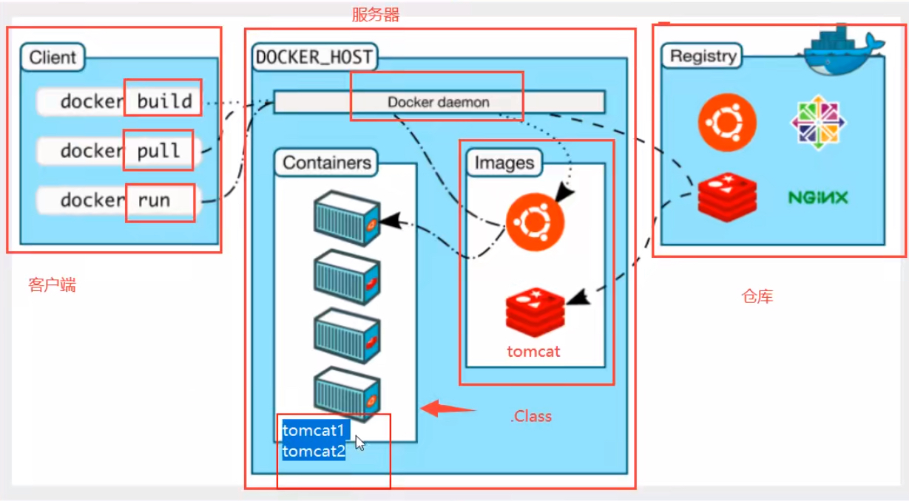
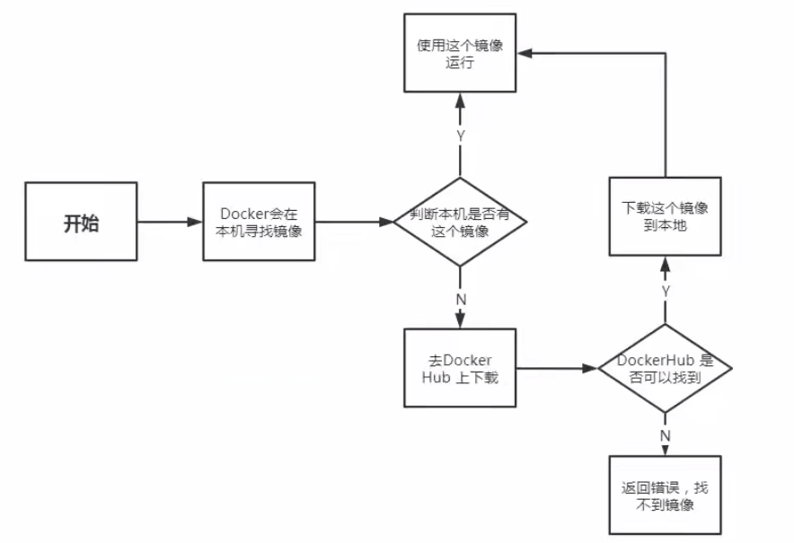
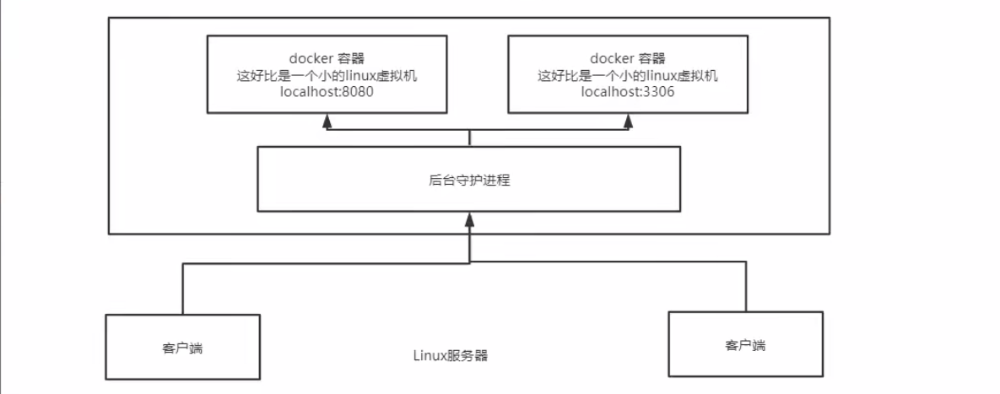
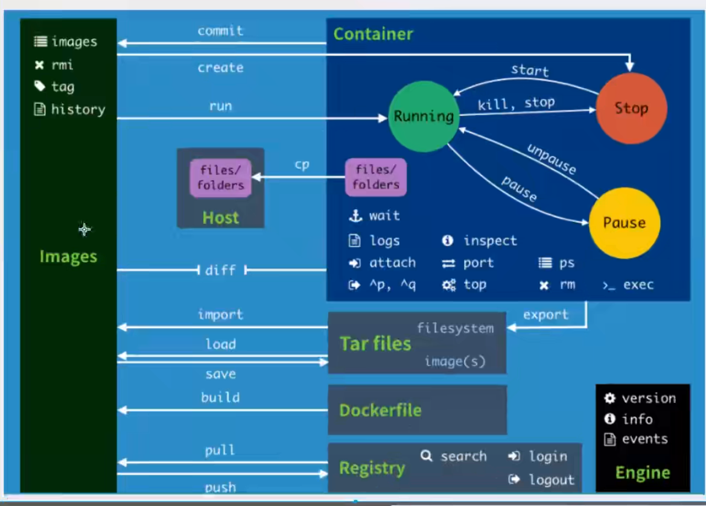
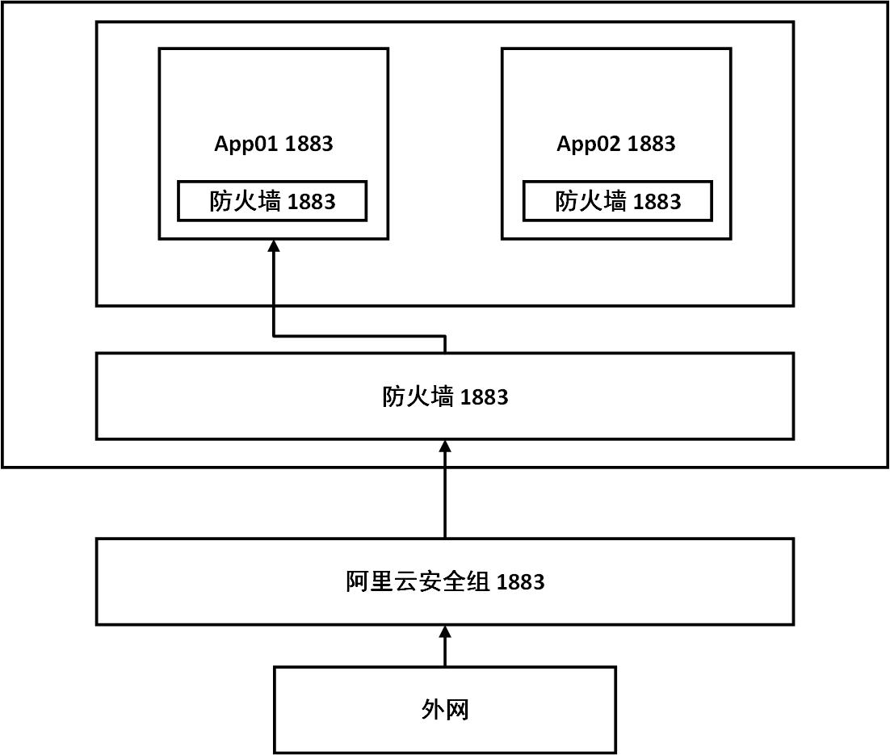

 

## Docker基础

### 1、基本组成

**镜像：**可以通过镜像来创建容器， app镜像===>run===>app容器（提供服务），一个镜像可以启动多个容器（分布式集群的搭建）

**容器：**Docker通过容器技术，独立运行一个或者一组应用。一个容器相当于一个简易的linux系统

**仓库：**存放镜像的地方，分为公有仓库和私有仓库

配置阿里云官方镜像加速器：

1. `sudo mkdir -p /etc/docker`

2. `sudo tee /etc/docker/daemon.json <<-'EOF'`

   `{`

   `"registry-mirrors": ["http://hd1esep4.mirror.aliyuncs.com"]`

   `}`

   `EOF`

3. `sudo systemctl daemon-reload`

4. `sudo systemctl restart docker`

### 2、docker的镜像run的流程图

### 3、Docker底层原理

Docker是一个CS结构的系统，Docker的守护进程运行在主机上，通过Socket从客户端访问。DockerServer接收到DockerClient的指令就会执行这个指令

### 4、Docker常用命令

> https://docs.docker.com/engine/reference/commandline

#### 镜像命令

------

**docker images**：查看本地主机上的镜像

**docker search**：搜索命令

**docker pull**：下载镜像

**docker rmi**： 删除镜像

------

#### 容器命令

------

**docker run [可选参数] image** ：新建容器并启动

> 参数说明
>
> ​	--name="Name" 容器名字 xx01  xx02 用来区分容器
>
> ​	--d			     后台方式运行
>
> ​	--it			      使用交互方式运行，进入容器查看内容
>
> ​	-p                          指定容器的端口   -p 8080：8080
>
> - -p ip：主机端口：容器端口
> - -p 主机端口：容器端口**（常用）**
> - -p 容器端口

**docker ps**：查看运行中的容器

> -a 查看所有容器（正在运行和历史运行）
>
> -n=x 显示最近创建的 x个容器
>
> -q 只显示容器的编号

**exit**：停止并退出正在运行的容器

**Ctrl+P+Q**：不停止但退出正在运行的容器

**docker rm 容器id**：删除容器，正在运行的容器必须强制删除-f

**docker start 容器id**：启动容器

**docker restart 容器id**：重启容器

**docker stop 容器id**: 停止当前正在运行的容器

**docker kill 容器id**：强制停止当前容器

**docker top 容器id**：查看容器内部的进程信息

**docker exec -it 容器id /bin/bash**：进入容器后开启一个新的终端，可以在里面操作

**docker attach 容器id**：进入容器正在执行的终端，不回启动新的进程！

**docker cp 1e3d0b0653e8:/home/test.java C:/Users/BINJ/Desktop**：从容器内复制文件到本地主机

> 拷贝（cp）是一个手动过程，使用 -v 卷的技术，可以实现自动同步， /home /home

### 小结

### 练习

#### 1、部署一个nginx

> - docker search nginx
>
> - docker pull nginx
>
> - docker run -d --name nginx01 -p 3344:80 nginx
>
> - 测试：
>
>   > curl localhost:3344 //向localhost:3344发出GET请求

##### 重要：端口暴露

##### 暴露问题

我们每次改动nginx配置文件，都需要进入容器内部？十分麻烦，要是可以在容器外部提供一个映射路径，达到在容器外修改文件名，容器内部就可以自动修改？ -v **容器卷**技术

